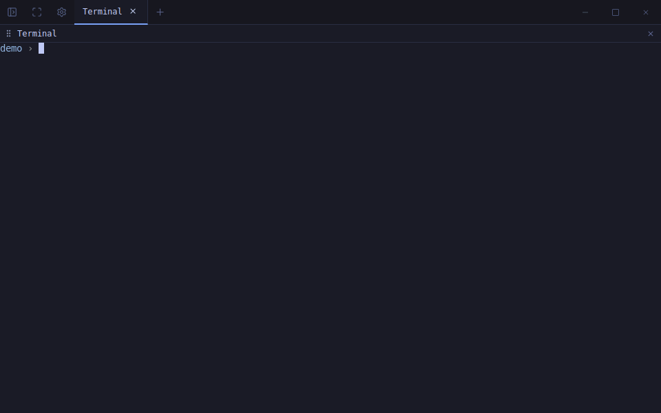

# Specterm

A GPU-accelerated terminal emulator for running coding agents in parallel.
Sessions survive closing the window, panes tell you when an agent is waiting, and
markdown renders inline. SolidJS + xterm.js on Electron — Linux, macOS, Windows.



## Install

Grab a build from [Releases](https://github.com/froquede/specterm/releases):
AppImage or `.deb` on Linux, `.exe` on Windows, `.dmg` on macOS (Apple silicon).

macOS is unsigned, so clear the quarantine flag once after installing:

```bash
xattr -dr com.apple.quarantine /Applications/Specterm.app
```

## Features

Splits with draggable dividers, tabs, and multiple windows — with tabs that tear
off and move between them. A filterable file sidebar with pinned favourites.
Markdown preview and editor with Mermaid, and a syntax-highlighted viewer for
everything else. Find in scrollback, WebGL rendering, five built-in themes plus
a 325-scheme base16 gallery, and a tab bar that stands in for the title bar.

## Keybindings

macOS uses `⌘`. Linux and Windows use the Kitty-style `Ctrl+Shift+<key>` scheme,
which keeps bare `Ctrl+<key>` free for terminal control codes.

| Action | macOS | Linux / Windows |
|---|---|---|
| New window | `⌘N` | `Ctrl+Shift+N` |
| New tab | `⌘T` | `Ctrl+Shift+T` |
| Reopen last closed tab / pane | `⌘⇧T` | `Ctrl+Shift+R` |
| Rename tab | `⌘R` | `F2` |
| Close tab | `⌘⇧W` | `Ctrl+Shift+Q` |
| Close pane | `⌘W` | `Ctrl+Shift+W` |
| Next / previous tab | `⌘⇧]` / `⌘⇧[` | `Ctrl+Shift+→` / `Ctrl+Shift+←` |
| Split — stacked | `⌘D` | `Ctrl+Shift+S` |
| Split — side by side | `⌘⇧D` | `Ctrl+Shift+Enter` |
| Focus pane left/right/up/down | `⌥`+arrow | `⌥`+arrow |
| Go to a pane waiting on you | `⌘⇧U` | `Ctrl+Shift+U` |
| Copy selection | `⌘C` | `Ctrl+Shift+C` |
| Paste (image inline if the clipboard holds only an image) | `⌘⇧V` | `Ctrl+Shift+V` |
| Paste as plain text | `⌘V` | `Ctrl+V` |
| Paste an image into Claude Code | `⌃V` | `Alt+V` |
| Find in terminal | `⌘F` | `Ctrl+Shift+F` |
| Toggle sidebar / search | `⌘B` | `Ctrl+Shift+B` |
| Toggle settings | `⌘,` | `Ctrl+Shift+,` |
| Markdown: edit / save | `⌘E` / `⌘S` | `Ctrl+Shift+E` / `Ctrl+S` |
| Font size up / down / reset | `⌘=` / `⌘-` / `⌘0` | `Ctrl+Shift+=` / `-` / `0` |
| Quit (ends detached sessions) | `⌘Q` | `Alt+F4` |

## Behaviours worth knowing

**Selection over mouse-tracking programs.** Full-screen programs turn on mouse
tracking, and a terminal then hands them every button press — which is why you
normally can't select text out of Claude Code or vim, and why every terminal's
answer is *"hold Shift"*. Specterm tells the two intents apart: a **click** goes
to the program, a **drag** past 3px becomes a local selection. `Shift+drag` still
works, `Alt+drag` selects a column. See `src/lib/mouse-selection.ts`.

**Moving tabs between windows.** Drag a tab — or a pane by its title-bar — past
the window edge. Release over another Specterm window to move it there, anywhere
else to make it a new window. The shell is handed over still running: its
scrollback is serialized and replayed, and anything it prints mid-move is
buffered and written back in order.

**Splits inherit the directory.** A new pane opens where the pane you split from
is. Read from the shell's own process, so it works without configuring anything;
`OSC 7` (which zsh and fish send by default) is used as a faster hint when present.

**Waiting panes.** Four independent signals — the standard `OSC 9`/`777`/`99`
notification sequences, the terminal bell, output-timing detection for Claude
Code, and Claude's own hooks. Three of them need no setup. Optional desktop
notifications are off by default. See [docs/waiting-panes.md](docs/waiting-panes.md).

**Theming.** Themes drive the terminal palette and the app chrome at once.
Settings → Theme → *Browse gallery* has 325 bundled
[base16](https://github.com/tinted-theming/schemes) schemes; you can also paste,
open or drag in your own.

## Development

```bash
npm install
# Rebuild node-pty against Electron's ABI — required after install/ci,
# or the PTY fails to load and terminals won't open.
npx electron-builder install-app-deps
npm run dev:electron
```

```bash
npm run test:e2e        # main suite
npm run test:e2e:all    # + multi-window, session continuity
npm run test:perf       # startup budget
```

The suites build the app, launch the **real** Electron binary and drive the
actual UI. See [test/README.md](test/README.md).

Windows needs a shell that `node-pty` can spawn; Specterm defaults to
`powershell.exe`, overridable with `SPECTERM_SHELL`. See
[docs/windows-setup.md](docs/windows-setup.md).

Releasing is documented in [docs/releasing.md](docs/releasing.md).

> `src/backends/` abstracts the host, and a dormant Tauri v2 implementation
> exists alongside the Electron one. It does not currently work — ship and test
> on Electron.

## Contributing

Issues and pull requests are welcome. Contributions are accepted under the
project's license (Apache-2.0, per its Section 5) — there's no CLA to sign.

## License

[Apache-2.0](LICENSE) — Copyright 2026 Roque Francisco and the Specterm
contributors.
