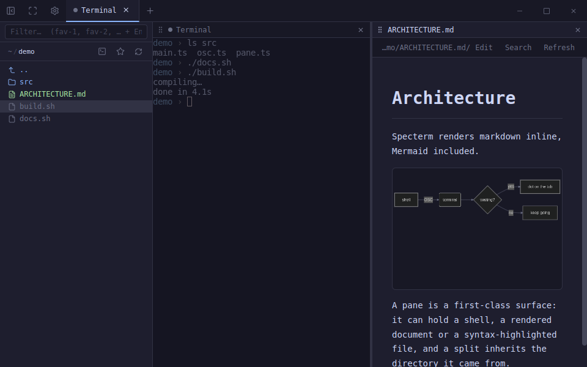

# Waiting panes

A coding agent you left running in another tab has no way to get your attention,
so you end up checking on it. Specterm flags the pane instead: a dot on its tab
chip and on its title-bar, the count on the dock icon (macOS, Unity) or a
flashing taskbar entry (Windows and most Linux WMs), and optionally a desktop
notification.



`⌘⇧U` / `Ctrl+Shift+U` jumps to a waiting pane, switching tabs to reach it.
Pressing it again goes to the next one — arriving at a pane clears its flag, so
the list empties as you work through it.

The dot goes out as soon as you focus the pane or type into it. A permission
prompt is drawn in the accent colour and pulses (nothing moves until you
answer); everything else is a quiet grey dot.

## How a pane is found to be waiting

Four independent signals feed the same indicator. Three of them need no setup at
all.

### Notification sequences — any program, no setup

Specterm honours the three standard "notify the user" escape sequences. Any tool
that already emits one — Claude Code, Codex, OpenCode, a `make` wrapper, a CI
script — lights up the pane it ran in, and its message becomes the tooltip.

| sequence | form | origin |
|---|---|---|
| `OSC 9` | `\e]9;<message>\a` | iTerm2 |
| `OSC 777` | `\e]777;notify;<title>;<body>\a` | urxvt |
| `OSC 99` | `\e]99;<key=value:…>;<payload>\e\\` | Kitty |

Try it:

```bash
printf '\e]9;Build finished\a'
printf '\e]777;notify;Tests;2 failed\a'
```

`OSC 99` supports Kitty's chunking (`d=0` for "more coming", joined on the `i=`
identifier) and base64 payloads (`e=1`). Its `close`, `alive` and capability-query
forms are swallowed rather than shown.

One deliberate exception: ConEmu overloaded `OSC 9` with numbered sub-commands,
and `9;4;<state>;<progress>` is a *progress bar* that tools emit continuously
while they work. Anything shaped like `<digits>;` is treated as a ConEmu control
and ignored, so a progress bar doesn't fire a notification per tick. A message
that merely starts with a digit still gets through.

### The terminal bell

`\a` flags the pane in every mode but *off*. It is how a program of any kind
asks to be looked at, so a long `make` that ends with a bell gets the same dot —
as does Claude Code with `preferredNotifChannel` set to `terminal_bell`.

### Claude Code, without setup — "detect it" (default)

A Claude session that's working repaints its spinner several times a second, and
the two states where it wants you — turn finished, permission prompt up — are
both perfectly silent. So *sustained output → silence* is the signal.

It is read purely from the timing of the output stream, never from the screen, so
a reworded Claude footer can't break it. Gated on a `claude` process actually
running in that pane, which the session poll already knows.

The trade-off: an unrelated long command finishing in a pane where Claude is also
running looks the same from outside the process.

### Claude Code, exactly — "let Claude say so"

Installs a `Notification` and a `Stop` hook into `~/.claude/settings.json`. Each
writes one escape sequence (`OSC 1337 ; Attention`) to `/dev/tty`, which is the
pane's own pty — so it lands in the right pane with nothing to correlate,
instantly, and it can tell a permission prompt apart from a finished turn.

No false positives. The two entries are added and removed from the same button
and nothing else in that file is touched. macOS/Linux only — Windows has no
`/dev/tty` a one-line hook can reach.

## Desktop notifications

Off by default. The dot, the dock badge and the taskbar flash already say a pane
is waiting without interrupting anything; an OS notification is the one thing
here that reaches outside the window, so it is opt-in.

Settings → **Also send a desktop notification**. When on it stays deliberately
quiet:

- silent — no sound, on top of a bell that may have arrived with it
- one per pane per wait, not one per message
- only while the window is in the background
- never more than one at a time, however many panes finish together
- clicking it brings that window forward

## Source

- `src/stores/attention.ts` — which panes are waiting, and why
- `src/lib/osc.ts` — the sequence parsers
- `src/lib/claude-attention.ts` — the output-timing detector
- `src/lib/claude-hooks.ts` — installing the Claude Code hooks
