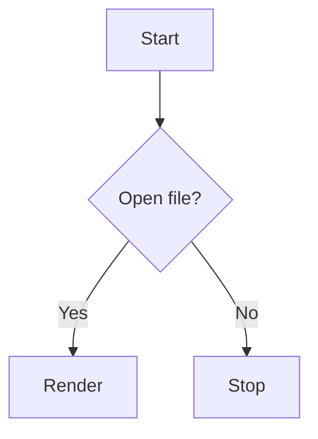

# Diagram fixture

Regression fixture for the markdown pane: prose plus a Mermaid diagram, used to
prove rendering, Mermaid execution, and the pan/zoom viewport still work.

## Flow

Some trailing text so search has something to match: SEARCHABLE_MARKER.
