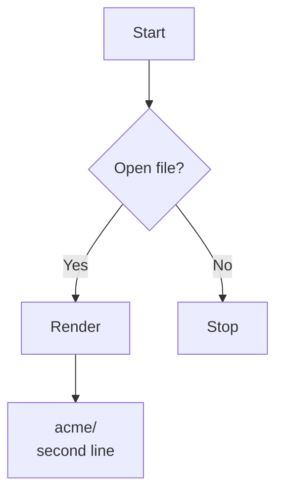

# Diagram fixture

Regression fixture for the markdown pane: prose plus a Mermaid diagram, used to
prove rendering, Mermaid execution, and the pan/zoom viewport still work. The
`<tenant>` placeholder and the ` ` in the labels guard the fence escaping:
written into the page raw, the browser parses them as tags and the diagram
fails to parse.

## Flow

```mermaid
graph TD
  A[Start] --> B{Open file?}
  B -->|Yes| C[Render]
  B -->|No| D[Stop]
  C --> E["acme/<tenant><br/>second line"]
```

Some trailing text so search has something to match: SEARCHABLE_MARKER.
